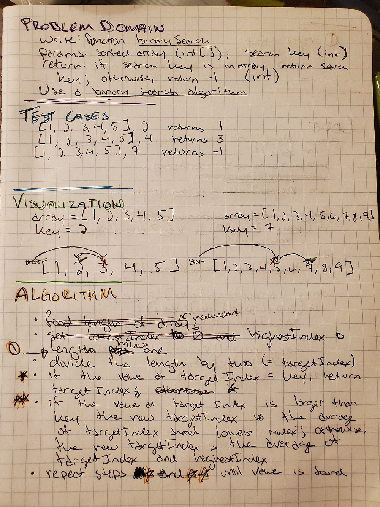
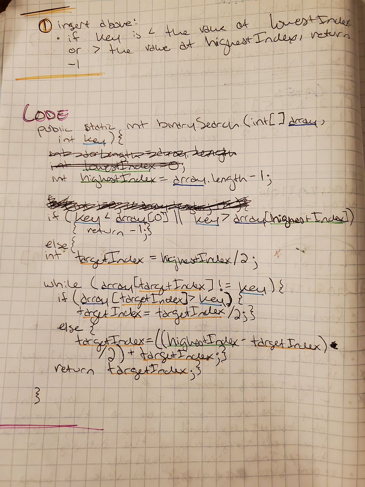

# Perform a Binary Search of an Array

## Whiteboard

## Approach/Efficiency

The method first checks to see if the provided key was either smaller than the value at index 0 of the array or higher than the value at the highest index of the array. If either of those was true, the method returns -1.

If neither is true, the method sets the target index to the midpoint of the array. If the value at that index is equal to the key, the function returns the target index. If the value at that index is greater than the key, the target index is set to half of itself; if it is less than the key, the target index is set to halfway between itself and the highest index. The while loop then checks again whether the value at the target index is equal to, larger than, or smaller than the key.

If the key is not in the array, ____________________________
