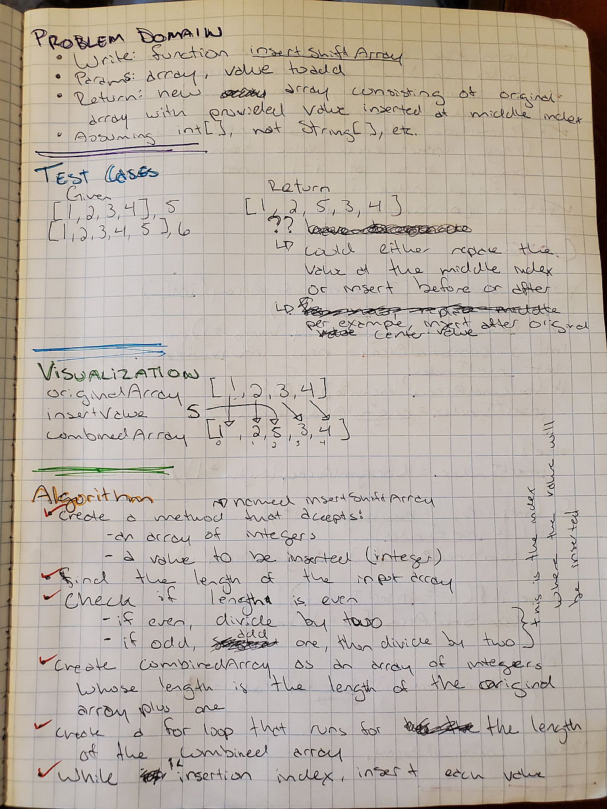
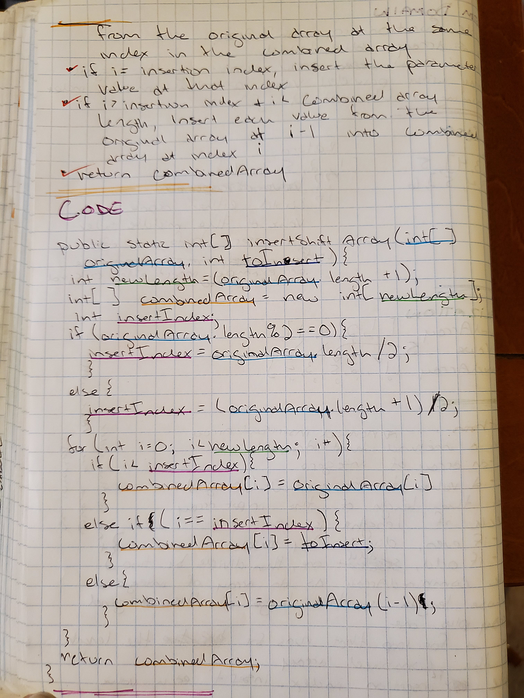

# Return an Array with Shifted Values

## Whiteboard

## Approach/Efficiency

I found the length of the original array, and used that to determine first the length of the new array (by adding one) and the position of the number to insert (by dividing by two). I then used a for loop to insert all values from the first array to the second at the same index until the loop reached the index to insert the new value, then insert that new value, then continue inserting the values from the original array.
