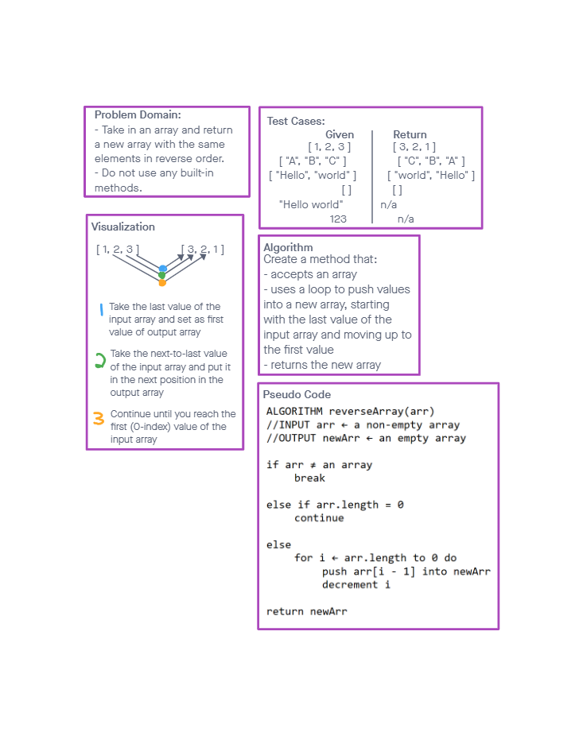

# Reverse an Array

## Whiteboard

## Approach/Efficiency

I used a for loop, preceded by an if statement to first stop the execution if the input isn't an array and second return an empty array if the input is an empty array.
