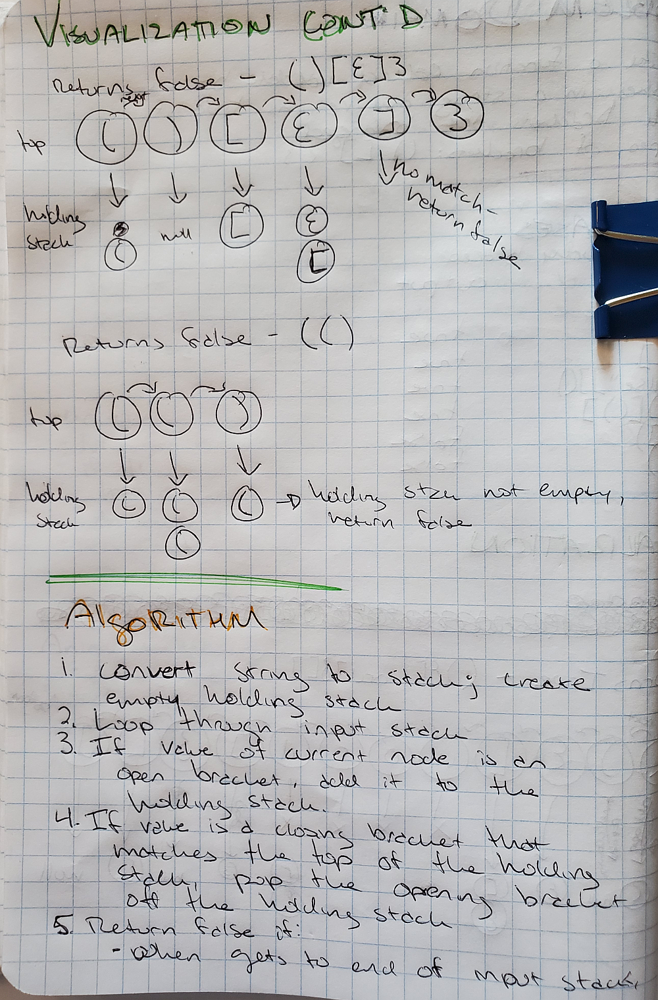
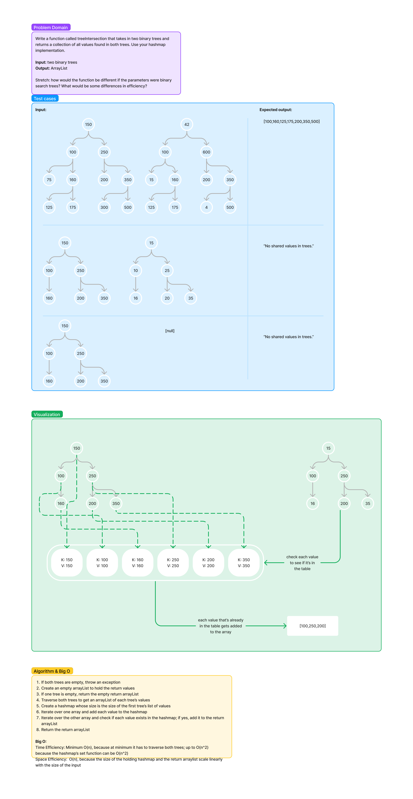

# Data Structures

## Implementation Notes

## Code Challenges

### Challenge 05 - Linked List Implementation

#### Summary

Create a Node class to hold a value and a pointer to another node, and a LinkedList class that creates a list of linked nodes.

Location: [lib/src/main/java/datastructures/linkedlist/LinkedList.java](lib/src/main/java/datastructures/linkedlist/LinkedList.java)

Tests: [lib/src/test/java/datastructures/linkedlist/LinkeListTest.java](lib/src/test/java/datastructures/linkedlist/LinkeListTest.java)

#### LinkedList.java

- Properties
  - Node `head`
- Constructor
  - *LinkedList* creates a new linked list with a head node whose value is null
- Methods
  - *insert(int value)* creates a new node whose value is the provided integer and inserts it at the beginning of the list. If the list is empty, becomes the new head node. Efficiency: O(1)
  - *includes(int value)* returns `true` if the value of any node in the list matches the provided integer and `false` if not. Efficiency: O(n)
  - *toString()* iterates through the list and returns a string containing every value and ending in "NULL", formatted as follows: "{<value of head node>} -> {<value of second node>} -> {<value of third node>} -> ... -> {<value of tail node>} -> NULL". If the list is empty, returns "NULL". Efficiency: O(n)

#### Node.java

- Properties
  - int `value`
  - Node `next`
- Constructor
  - Creates a new node whose value is the provided integer. If no integer is provided, creates a node whose value is 0.

#### Testing

[//]: # (TODO: describe tests)

### Challenge 06 - Linked List Insertions

In the LinkedList class, create a method to append a node with the provided value to the end of the list and to insert nodes with the provided value either before or after a target value.

Location: [lib/src/main/java/datastructures/linkedlist/LinkedList.java](lib/src/main/java/datastructures/linkedlist/LinkedList.java)

Tests: [src/test/java/datastructures/linkedlist/LinkeListTest.java](lib/src/main/java/datastructures/linkedlist/LinkedList.java)

#### LinkedList.java

- Methods
  - *append(int value)* creates a new node whose value is the provided integer and inserts it at the end of the list. Efficiency: O(n)
  - *insertBefore(int value, int targetValue)* creates a new node whose value is the provided integer and inserts it before the first node whose value is the provided target value. Throws an exception if the list is empty or if the target value is not in the list. Efficiency: O(n)
  - *insertAfter(int value, int targetValue)* creates a new node whose value is the provided integer and inserts it after the first node whose value is the provided target value. Throws an exception if the list is empty or if the target value is not in the list. Efficiency: O(n)

#### Testing

[//]: # (TODO: describe tests)

### Challenge 07

In the LinkedList class, create a method called kthFromEnd that returns the value that is k nodes from the end of a linked list.

Location: [lib/src/main/java/datastructures/linkedlist/LinkedList.java](lib/src/main/java/datastructures/linkedlist/LinkedList.java)

Tests: [src/test/java/datastructures/linkedlist/LinkeListTest.java](lib/src/main/java/datastructures/linkedlist/LinkedList.java)

#### Whiteboard

#### LinkedList.java

- Methods
  - *kthFromEnd(int k)* uses a while loop to add a `previous` property to each node, pointing at the previous node. When the last node is reached, starts a for loop that runs for `k` iterations while moving back through the list using the new `previous` property on each node. Returns the value that is `k` nodes from the end. Throws an exception if the provided k value is larger than the length of the list. Efficiency: O(n).
  - To do: refactor to account for if nodes already have a previous property.

#### Testing

[//]: # (TODO: describe tests)

### Challenge 08

In the LinkedList class, create a method that zips two linked lists together and returns the lists' alternating values in another linked list.

*Stretch goal:* create a method that zips two sorted lists together and returns a sorted list.

Location: [lib/src/main/java/datastructures/linkedlist/LinkedList.java](lib/src/main/java/datastructures/linkedlist/LinkedList.java)

Tests: [src/test/java/datastructures/linkedlist/LinkeListTest.java](lib/src/main/java/datastructures/linkedlist/LinkedList.java)

#### Whiteboard

#### LinkedList.java

- Methods
  - *zipLists(LinkedList list1, LinkedList list2)* takes two linked lists and inserts the values from the second list into the first list in an alternating (zipped) pattern. It essentially swaps each list's nodes to point to the other list's next node; when one list is empty, adds the rest of the nodes of the other list, in order. Trows an exception if both lists are null. Time efficiency: O(n); space efficiency O(1).
  - *zipSortedLists(LinkedList list1, LinkedList list2)* takes in two sorted lists. It checks the head value of each list, inserts the lower value into the output list, and advances to the next node of that list. It continues comparing the nodes from each list, inserting the lower of the two values, and advancing through the lists until there are no values left in one or both lists. If one list has values left over, they are inserted in order. Duplicate values will be duplicated (i.e., if each list has a node whose value is 5, the output list will have two consecutive nodes whose value is 5. Throws an exception if both lists are null.  Efficiency: O(n^2) because calls *append* to add the value; refactor to improve efficiency.
  - To do: refactor to reduce size (do not call *append*)

#### Testing

[//]: # (TODO: describe tests)

### Challenge 10

Using a Linked List as the underlying data storage mechanism, implement both a Stack and a Queue.

Location: [lib/src/main/java/datastructures/linkedlist/Stack.java](lib/src/main/java/datastructures/linkedlist/Stack.java); [lib/src/main/java/datastructures/linkedlist/Queue.java](lib/src/main/java/datastructures/linkedlist/Queue.java)

Tests: [lib/src/test/java/datastructures/linkedlist/StackTest.java](lib/src/test/java/datastructures/linkedlist/StackTest.java); [lib/src/test/java/datastructures/linkedlist/QueueTest.java](lib/src/test/java/datastructures/linkedlist/QueueTest.java)

#### Stack.java

- Properties:
  - Node `top`
- Constructor
  - *Stack* creates a new stack with a null top
- Methods
  - *push(int value)* creates a node whose value is the provided value and inserts it at the top of the stack. Efficiency: O(1)
  - *pop()* removes the top node of the stack and returns its value. Throws an exception if the stack is empty. Efficiency: O(1)
  - *peek()* returns the value of the top node of the stack without modifying the stack. Throws an exception if the stack is empty. Efficiency: O(1)
  - *isEmpty()* returns `true` if the stack is empty and `false` if it is not. Efficiency: O(1)

##### Testing

- *testCreate* tests whether the Stack constructor creates a stack whose top node is null.
- *testPush* tests whether values can be successfully pushed onto the top of the stack.
- *testPop* tests whether pop() throws an exception if the stack is empty and whether it returns the correct value and removes the top node if the stack is not empty.
- *testPeek* tests whether peek() throws an exception if the stack is empty and whether it returns the correct value if the stack is not empty.
- *testIsEmpty* tests whether isEmpty() returns true for an empty stack and false for a non-empty one.

#### Queue.java

- Properties:
  - Node `front`
  - Node `rear`
- Constructor
  - *Queue* creates a new queue with a null front and rear
- Methods
  - *enqueue(int value)* creates a node whose value is the provided value and inserts it at the rear of the queue. Efficiency: O(1)
  - *dequeue()* removes the front node of the queue and returns its value. Throws an exception if the queue is empty. Efficiency: O(1)
  - *peek()* returns the value of the front node of the queue without modifying the queue. Throws an exception if the queue is empty. Efficiency: O(1)
  - *isEmpty()* returns `true` if the queue is empty and `false` if it is not. Efficiency: O(1)

##### Testing

- *testCreate* tests whether the Queue constructor creates a queue whose front and rear nodes are null.
- *testEnqueue* tests whether values can be successfully enqueued at the rear of the queue.
- *testDequeue* tests whether dequeue() throws an exception if the queue is empty and whether it returns the correct value and removes the front node if the queue is not empty.
- *testPeek* tests whether peek() throws an exception if the queue is empty and whether it returns the correct value if the queue is not empty.
- *testIsEmpty* tests whether isEmpty() returns true for an empty queue and false for a non-empty one.

### Challenge 11

Create a PseudoQueue class that behaves like a queue externally, but internally uses two stacks to manage nodes.

Location: [lib/src/main/java/datastructures/linkedlist/PseudoQueue.java](lib/src/main/java/datastructures/linkedlist/PseudoQueue.java)

Tests: [lib/src/test/java/datastructures/linkedlist/PseudoQueueTest.java](lib/src/test/java/datastructures/linkedlist/PseudoQueueTest.java)

#### PseudoQueue.java

- Properties
  - Stack<T> `forwardStack`
  - Stack<T> `backwardStack`
- Constructor
  - *PseudoQueue* creates a new pseudoqueue with forwardStack and backwardStack properties; each stack's top node is null.
- Methods
  - *enqueue(T value)* creates a new node whose value is the provided value and inserts it at the top of the backwardStack and the bottom of the forwardStack. Efficiency: O(n)
  - *dequeue(T value)* removes the node at the "front" of the pseudoqueue (i.e., the node at the top of the forwardStack and the bottom of the backwardStack) and returns its value. Throws an exception if the pseudoqueue is empty. Efficiency: O(n)

#### Testing

- *testCreatePseudoqueue* confirms that a new pseudoqueue will have a forwardStack and backwardStack property, and that the top node of each stack is null.
- *testEnqueue* confirms that the provided value is added to the correct position in both stacks.
- *testDequeue* confirms that calling dequeue on a pseudoqueue results in an exception if the pseudoqueue is empty, and removes the correct node/returns the correct value if not.

### Challenge 12

Create an AnimalShelter class that holds dog and cat objects. The class should be a Queue, utilizing first in/first out principles, but users are able to specify whether they want a dog or a cat.

Location: [lib/src/main/java/datastructures/linkedlist/AnimalShelter.java](lib/src/main/java/datastructures/linkedlist/AnimalShelter.java)

Tests: [lib/src/test/java/datastructures/linkedlist/AnimalShelter.java](lib/src/main/java/datastructures/linkedlist/AnimalShelter.java)

#### Whiteboard

#### AnimalShelter.java

- Properties
  - *Node<Animal>* front
  - *Node<Animal>* rear
- Constructor
  - *AnimalShelter* creates a new AnimalShelter with null front and rear nodes.
- Methods
  - *enqueue(String name, String type)* creates a new Animal object and sets it as the value of a new node, then inserts that node at the rear of the AnimalShelter queue. Efficiency: O(1)
  - *dequeue(String type)* starts at the front of the AnimalShelter queue and finds the first node whose Animal object's type property matches the provided type. It returns the value of that node and removes it from the queue. Efficiency: O(n)

#### Testing

- *testCreateAnimalShelter* confirms that a new AnimalShelter will have a front and rear property, both of which are null.
- *testEnqueue* confirms that the provided animal is added to the correct position in the queue.
- *testDequeue* confirms that calling dequeue on an AnimalShelter removes the correct node and returns its value.

### Challenge 13

Create a method called validate brackets, which takes in a string and returns true if all brackets in the string are balanced (i.e., all opening brackets have a matching closing bracket and brackets are not overlapping).

Location: [lib/src/main/java/datastructures/linkedlist/LinkedList.java](lib/src/main/java/datastructures/linkedlist/LinkedList.java)

Tests: [lib/src/test/java/datastructures/linkedlist/LinkedList.java](lib/src/test/java/datastructures/linkedlist/LinkedList.java)

#### Whiteboard

#### LinkedList.java

- Method
  - *validateBrackets(String inputString)*
    1. Throw an exception if the string is empty.
    2. Create a holding stack, an arrayList of opening brackets, an arrayList of closing brackets, and a bracket counter. Each closing bracket should be at the same index in its arrayList as the matching opening bracket is in its arrayList. The bracket counter starts at 0.
    3. Loop through the provided string character by character.
    4. If the current character is an opening bracket, add it to the top of the holding stack and move to the next character. Increment the bracket counter.
    5. If the current character is a closing bracket, increment the bracket counter and check if the top value of the holding stack is the matching opening bracket. If yes, pop that value off the holding stack. If no (including if the holding stack is empty), return false.
    6. After the for loop has iterated through the whole string, if the bracket counter is still 0, throw an exception with message "There are no brackets in the string." If there are still values in the holding stack (i.e., not every opening bracket had a matching closing bracket), return false. Otherwise, return true.
  - Time Efficiency: O(n)
  - Space Efficiency: O(n)

#### Testing

- *testValidateBrackets* provides several strings and confirms they return true or false as expected; also confirms that empty strings and strings with no brackets return appropriate exceptions.

### Challenge 15

Implement a binary tree and a binary search tree.

Location: [lib/src/main/java/datastructures/trees/Node.java](lib/src/main/java/datastructures/trees/Node.java); [lib/src/main/java/datastructures/trees/BinaryTree.java](lib/src/main/java/datastructures/trees/BinaryTree.java); [lib/src/main/java/datastructures/trees/BinarySearchTree.java](lib/src/main/java/datastructures/trees/BinarySearchTree.java);

Tests: [lib/src/test/java/datastructures/trees/TreesTest.java](lib/src/test/java/datastructures/trees/TreesTest.java)

#### Node.java

- Properties
  - *T* value
  - *Node<T>* left
  - *Node<T>* right
- Constructors
  - *Node()* creates a new node whose value is null
  - *Node(T value)* creates a new node whose value is the provided value

#### BinaryTree.java

- Properties
  - *Node<T>* root
- Constructors
  - *BinaryTree()* creates a new binary tree whose root is null
  - *BinaryTree(Node<T> root)* creates a new binary tree whose root is the provided node
- Methods
  - *getValuesPreOrder()* creates an empty ArrayList to hold the values generated while traversing the tree, then calls *preOrder*, passing in the list and the tree's root node.
  - *preOrder(Node<T> root, ArrayList<T> values)* adds the value of the root node to the list of values, then checks if the root has a left child node. If yes, it calls itself on the root's left node and repeats the process; if no, it checks if the node has a right child node and if yes, calls itself on the root's right node. If both child nodes are empty, the function returns, until every node has been visited and its value has been recorded.
  - *getValuesInOrder()* creates an empty ArrayList to hold the values generated while traversing the tree, then calls *inOrder*, passing in the list and the tree's root node.
  - *inOrder(Node<T> root, ArrayList<T> values)* starts by checking for a left child node and proceeding down the tree until it finds a node with no left child. It adds the value of that node to the list of values, then checks if the node has a right child node. If yes, it checks that node for a left child, continuing the pattern until every node has been visited and its value has been recorded.
  - *getValuesPostOrder()* creates an empty ArrayList to hold the values generated while traversing the tree, then calls *postOrder*, passing in the list and the tree's root node.
  - *postOrder(Node<T> root, ArrayList<T> values)* starts by checking for a left child node and proceeding down the tree until it finds a node with no left child. It then checks if the node has a right child node; if yes, it moves to that child node and continues the process until it finds a node with no children. It adds the value of that node to the list of values, then continues the pattern until every node has been visited and its value has been recorded.

#### BinarySearchTree.java

- Extends BinaryTree
- Properties
  - inherits root from Binary Tree
- Constructors
  - *BinarySearchTree()* inherited from BinaryTree (creates a new tree whose root is null)
  - *BinaryTree(Node<Integer> root)* creates a new binary search tree whose root is the provided node (the node's value must be an Integer)
- Methods
  - *add(Integer value)* creates a new node whose value is the provided Integer. If the root of the tree is null, sets the new node as the root; otherwise, calls *addNode* and passes in the root and the new node.
  - *addNode(Node<Integer> root, Node<Integer> newNode)* checks whether the provided value is greater than or less than the value of the root node. (If neither - i.e., they are equal - the method returns.) If the value of the root is greater than the value of the new node, it then checks if the root's left child node is null; if yes, it sets the new node as the root's left child node, and if no, it calls itself on the left child node. The pattern repeats until the new node has been added to the tree such that it is greater than every node to its left and less than every node to its right.
  - *contains(Integer value)* returns true if the provided Integer is the value of one of the nodes in the tree. It checks by looking at each node and determining whether its value is equal to, greater than, or less than the provided Integer. If the values are equal, it returns true. It returns false if: the current node has no children; the value of the current node is greater than the Integer and the current node has no left children; or the value of the current node is less than the Integer and the current node has no right children. Otherwise, it continues down the tree, choosing left or right child node depending on whether the value of the current node is greater or less than the integer.

#### Testing

- *testCreateTree* creates a BinaryTree with a null root, a BinaryTree with a single node, a BinarySearchTree with a null root, and a BinarySearchTree with a single node, then tests to confirm the root values are correct/null, as appropriate.
- *testPreOrderTraversal*, *testInOrderTraversal*, and *testPostOrderTraversal*  call *getValuesPreOrder*, *getValuesInOrder*, *getValuesPostOrder*, respectively, and confirm that each method returns the expected values in the expected order.
- *testAdd* creates three binary search trees with the same values provided in a different order, then traverses each tree to confirm that the values are all present in the expected position.
- *testContains* creates a binary search tree, then confirms that calling contains() on that tree will return true if the provided value is in the tree, and false if it is not.

### Challenge 16

Add a method to the BinaryTree class that returns the highest value stored in a tree of integers.

Location: [lib/src/main/java/datastructures/trees/BinaryTree.java](lib/src/main/java/datastructures/trees/BinaryTree.java);
Tests: [lib/src/test/java/datastructures/trees/TreesTest.java](lib/src/test/java/datastructures/trees/TreesTest.java)

#### Whiteboard

#### BinaryTree.java

- Methods
  - *getMax()* creates an integer array whose only value is the value of the root node of the tree, then passes the root and that holding array to *findMax*. Returns the value at index 0 of the holding array.
  - *findMax(Node<Integer> root, int[] valueHolder)* compares the value of the root node to the value at index 0 of the holding array; if the node's value is greater, it replaces the value at index 0. It then checks if the root has a left child node. If yes, it calls itself on the root's left node and repeats the process; if no, it checks if the node has a right child node and if yes, calls itself on the root's right node. If both child nodes are empty, the function returns, until every node has been visited and its value has been compared. Efficiency: time is O(n) because it has to visit every node of the tree; space is O(n) because the holding array is a constant size.

#### Testing

- *testFindMax* confirms that calling *getMax* on a test tree returns the expected maximum value (or, if the test tree has no nodes, throws an exception).

### Challenge 17

Add a method to the BinaryTree class that traverses a list breadth-wise and returns a list of values in the order they are encountered.

Location: [lib/src/main/java/datastructures/trees/BinaryTree.java](lib/src/main/java/datastructures/trees/BinaryTree.java);
Tests: [lib/src/test/java/datastructures/trees/TreesTest.java](lib/src/test/java/datastructures/trees/TreesTest.java)

#### Whiteboard

#### BinaryTree.java

- Methods
  - *breadthFirst(BinaryTree tree)* checks if the tree is empty and returns an exception if yes. If no, it creates an empty queue and ArrayList and enqueues the root value of the tree. While the front node of the queue is not null, it enqueues the left and right children of the front node (if present), adds the value of the front node to the list of values, and dequeues the front node. When all nodes have been processed, returns the ArrayList of values. Efficiency: time & space are both O(n); the method always has to traverse the entire tree, but only once, and the size of the queue and ArrayList scale linearly with the size of the input.

#### Testing

- *testBreadthFirst* confirms that calling *breadthFirst* on a test tree returns the expected list of values (or, if the test tree has no nodes, throws an exception).

### Challenge 18

Add a method to the BinaryTree class that takes in a k-ary tree and returns a tree in the same shape with node values as follows:
- If the value of the corresponding node of the input tree is divisible by 3 but not 5, value is "Fizz"
- If the value of the corresponding node of the input tree is divisible by 5 but not 3, value is "Buzz"
- If the value of the corresponding node of the input tree is divisible by 3 and 5, value is "FizzBuzz"
- If none of the above, the value is the value of the input node as a string

Location: [lib/src/main/java/datastructures/trees/BinaryTree.java](lib/src/main/java/datastructures/trees/BinaryTree.java);
Tests: [lib/src/test/java/datastructures/trees/TreesTest.java](lib/src/test/java/datastructures/trees/TreesTest.java)

#### Whiteboard

#### BinaryTree.java

- Methods
  - *getFizzBuzz(BinaryTree tree)* checks if the tree is empty and returns an exception if yes. If no, it creates an output tree with a root node whose value is null and passes that root and the root of the input tree to *fizzBuzz*.
  - *fizzBuzz(Node inputRoot, Node outputRoot)* traverses the input tree; at each node, it checks if the node is null. If yes, it continues the traversal or returns; if not, it checks if the value is divisible by 3, 5, or both, and sets the value of the corresponding node on the output tree. When all nodes have been traversed, returns output tree.
  - Efficiency: time & space are both O(n); the method always has to traverse the entire tree, but only once, and the size of the output tree scales linearly with the size of the input.

#### Testing

- *testFizzBuzz* confirms that calling *getFizzBuzz* on a test tree returns the expected list of values (or, if the test tree has no nodes, throws an exception).

### Challenge 26 - Insertion Sort

[Readme](./lib/src/main/java/datastructures/sorting/insertion/README.MD)

### Challenge 27 - Merge Sort

[Readme](./lib/src/main/java/datastructures/sorting/merge/README.md)

### Challenge 28 - QuickSort

[Readme](./lib/src/main/java/datastructures/sorting/quick/README.md)

### Challenge 29 - Implement a HashMap

Implement a HashTable class with *set()*, *get()*, *has()*, *getKeys()*, and *hash()* methods.

Location: [lib/src/main/java/datastructures/hashmap/HashMap.java](lib/src/main/java/datastructures/hashmap/HashMap.java); [lib/src/main/java/datastructures/hashmap/HashMapPair.java](lib/src/main/java/datastructures/hashmap/HashMapPair.java);
Tests: [lib/src/test/java/datastructures/hashmap/HashMapTest.java](lib/src/test/java/datastructures/hashmap/HashMapTest.java)

#### HashMap.java

- Properties
  - *ArrayList<LinkedList<HashMapPair<K, V>>>* bucketArrayList
  - *int* size
- Constructors
  - *HashMap(int size)* creates a new empty hashmap of size *size*
- Methods
  - *set(K key, V value)* calls *hash* on the key to find its index. It then calls *get* on the provided key; if *get* returns a value other than the value provided, it replaces the existing value with the provided value. If not, it creates a new HashMapPair using the provided key and value, retrieves the linked list at the hashed index, adds the new hash map pair to the list, and sets it to the hashed index again. Time efficiency: could be as high as O(n^2), if the for loops (one in *get*, one setting a new value to an existing key) have to loop through all values (if they were all at the same index, for example). Space efficiency: O(n) because the space scales linearly with the addition of new elements.
  - *get(K key)* first hashes the provided key to determine its index in the hashmap, then retrieves the linked list from that index. It iterates through the linked list to find the value associated with the provided key and returns that value. If the key is not in the list, returns null. Time efficiency: could be as high as O(n), if the for loop to find the provided key has to loop through all values (if they were all at the same index, for example). Space efficiency: O(1) because the size of the data structure doesn't change.
  - *getKeys()* creates an empty ArrayList to hold the keys. It loops through every element in the hashmap, checking if it is empty. If no, it loops through each key-value pair in the linked list, adding the key value from each node of the list into the list of keys. After looping through the whole hashmap, checks if the list of keys is still empty. If no, it returns the list, and if yes, it returns null. Time efficiency: O(n) because it has to loop through every element once and only once. Space efficiency: O(n) because the size of the output scales linearly with the size of the input.
  - *has(K key)* first calls *getKeys*. If the result is not null and the provided key is in the list, returns true; otherwise, returns false. Time efficiency: O(n) because *getKeys* and *contains* have loops, but they're not nested. Space efficiency O(1) because the size of the data structure doesn't change.
  - *hash(K key)* uses Java's built-in *hashcode()* method to generate a hash code for the provided key.

#### HashMapPair.java

- Properties
  - *K* key
  - *V* value
- Constructor
  - *HashMapPair(key, value)* creates a new hashmap pair with the provided key and value.

#### Testing

- *testCreateHashMap* creates an empty hashmap, then confirms that calling *get* and *getKeys* on the empty map successfully returns null.
- *testAddToHashMap* creates an empty hashmap, calls *set* several times with test key-value pairs, then calls *has* to confirm that each key has been successfully added.
- *testGet* creates an empty hashmap, calls *set* several times, then confirms that calling *get* on the provided keys returns the expected value (or null, if the key is not in the map).
- *testGetKeys*  creates an empty hashmap, calls *set* several times, then calls *getKeys* and confirms whether the resulting list contains the provided keys.
- *testCollision* creates an empty hashmap of size one, calls *set* several times. It confirms that the keys hash to the same value (since the map has only one available index), then calls *get* and *getKeys* to make sure the provided values are in the map. It then calls *set* with an existing key but a new value, then confirms that calling *get* and passing in that key returns the expected value.

### Challenge 31 - repeatedWords

Write a function called repeatedWord that takes in a string and returns the first word that appears in the string more than once.

Location: [lib/src/main/java/datastructures/hashmap/HashMap.java](lib/src/main/java/datastructures/hashmap/HashMap.java)
Tests: [lib/src/test/java/datastructures/hashmap/HashMapTest.java](lib/src/test/java/datastructures/hashmap/HashMapTest.java)

#### Whiteboard

#### HashMap.java

- Methods
  - *repeatedWord(String inputString)* first creates a string to hold all allowed characters, a holding queue to temporarily store characters, and a holding hashmap to store each word. It then iterates through each character in the string and checks it against the allowed character string. If the character is in the allowed string, it is set to lower case and added to the holding queue. If the character is not in the allowed string, and the holding queue is not empty, the function dequeues each character in the holding queue to form a word. If the word ends in "'s", those two characters are discarded. The function then checks to see if an object with the key of that word exists in the table. If no, the word is added to the table with itself as the key and the value; if yes, the function returns that word. If the string is empty, throws an exception. Time efficiency: minimum O(n); space efficiency: O(n).

#### Testing

- *testRepeatedWord* creates several testing strings:
  - One with no repeating words
  - One where the repeated word is possessive and capitalized in one instance but not the other
  - One with a bunch of weird punctuation
  - A long one
  and confirms that each one returns the expected result when passed to *repeatedWord*

### Challenge 32 - treeIntersection

Write a function called treeIntersection that takes in two binary trees and returns a collection of all values that appear in both trees.

Location: [lib/src/main/java/datastructures/TreeIntersection/TreeIntersection.java](lib/src/main/java/datastructures/TreeIntersection/TreeIntersection.java)
Tests: [lib/src/test/java/datastructures/treeintersection/TreeIntersectionTest.java](lib/src/test/java/datastructures/treeintersection/TreeIntersectionTest.java)

#### Whiteboard

#### TreeIntersection.java

- Methods
  - *treeIntersection(BinaryTree treeOne, BinaryTree treeTwo)* first checks if both trees are empty; if yes, it throws an exception. If no, it creates an empty array to hold the return values. If neither tree is empty, it traverses both and creates an arrayList of each tree's values. It then creates a hashmap whose size is the size of the list of the first tree's values, and iterates over that list to add each value to the hashmap. Next, it iterates over the second list and checks to see if each value is already in the hashmap. If yes, it adds that value to the return list. When the for loop has concluded, it returns the arrayList of values. Time efficiency: minimum O(n) because it must iterate over each tree and the list of each tree's values, but those iterations are not nested; could be as high as O(n^2) because checking the hashmap for a value can be exponential. Space efficiency: O(n) because the size of structures created scales linearly with the size of the input.

#### Testing

- *testTreeIntersection* creates several testing trees:
  - One to compare the rest with
  - One with some overlapping values
  - One with no overlapping values
  - An empty one
  and confirms that each one returns the expected result when passed to *treeIntersection*
  -
### Challenge 33 - HashMap Left Join

Write a function called leftJoin that performs a simplified left join between two hashmaps.

Location: [lib/src/main/java/datastructures/hashmap/HashMap.java](lib/src/main/java/datastructures/hashmap/HashMap.java)
Tests: [lib/src/test/java/datastructures/hashmap/HashMapTest.java](lib/src/test/java/datastructures/hashmap/HashMapTest.java)

#### Whiteboard

#### TreeIntersection.java

- Methods
  - *leftJoin(HashMap<String, String> leftHashMap, HashMap<String, String> rightHashMap* first creates an empty arraylist to hold the return values, then calls *getKeys* on the left HashMap to get a list of keys. It iterates through the list of keys, appending each key and its value to a temporary string. It then calls *has* on the right HashMap to check if it contains the current key; if yes, it gets that value from the right HashMap and appends it to the temporary string. If no, it appends "null". It then adds that string to the return arraylist. When all keys have been iterated over, returns the arraylist. Time efficiency: minimum O(n) because it must iterate over the entire left hashmap; could be as high as O(n^2) because checking the hashmap for a value can be exponential. Space efficiency: O(n) because the size of any new structures created scales linearly with the size of the input.

#### Testing

- *testLeftJoin* creates three hashmaps:
  - One to compare the rest with
  - One with some overlapping values
  - One with no overlapping values
  and confirms that each one returns the expected result when passed to *leftJoin*

### Challenge 35 - Graph Implementation

Implement a graph.

Location: [lib/src/main/java/datastructures/graph/Graph.java](lib/src/main/java/datastructures/graph/Graph.java); [lib/src/main/java/datastructures/graph/Node.java](lib/src/main/java/datastructures/graph/Node.java); [lib/src/main/java/datastructures/graph/Edge.java](lib/src/main/java/datastructures/graph/Edge.java)
Tests: [lib/src/test/java/datastructures/graph/GraphTest.java](lib/src/test/java/datastructures/graph/GraphTest.java)

#### Graph.java

- Properties
  - *HashMap<Node<T>, LinkedList<Edge<T>>>* adjacencyList
  - *int* nodeCount
- Constructor
  - *Graph(int maxNodes)* creates a new adjacencyList hashmap whose size is the provided integer. The adjacencyList's keys are nodes, and its values are linked lists of edges. (Note that this implementation uses java.util.HashMap, not the HashMap class in this library).
- Methods
  - *addValue(T value)* creates a new node whose value is the provided value, then checks if a node with that value is in the adjacencyList already. If yes, it throws an exception (may remove this in the future); if no, it creates a new linked list of edges, then saves both values to the adjacencyList with the new node as the key and the list of edges as the value. Also increments the graph's nodeCount property. Time efficiency O(1) because creating structures and adding to hashmaps are both O(1). Space efficiency O(n) because the size of the graph scales linearly with the size of the input.
  - *addEdge(Node<T> start, Node<T> destination)* calls *addEdge*, passing in start, destination, and 0.
  - *addEdge(Node<T> start, Node<T> destination, int weight)* first checks if both nodes are in the graph; if no, it throws an exception. If yes, it creates a new Edge object, passing in destination and weight. It then retrieves the value of the start node (a linked list of edges) from the adjacencyList, adds the new edge, and saves the node and list back to the adjacencyList. Time efficiency as low as O(1); up to O(n^2) if the graph is poorly designed and nodes have to share indices in the hashmap. Space efficiency O(1) because edges are the same size each time.
  - *getNodes()* creates an empty linked list, then calls *getKeys()* on the adjacencyList, iterates through the resulting list, adds each value to the linked list, and returns it. Time efficiency O(n) because it iterates through both the adjacencyList and the list of keys, but loops are not nested. Space efficiency O(n) because the output size scales linearly with the size of the input.
  - *getNeighbors(Node<T> node)* uses the provided node as the key to return that node's linked list of edges from the adjacencyList. Time efficiency: O(1) unless the hashmap is very poorly designed. Space efficiency: O(1) because does not create new data structures.
  - *size()* returns the graph's nodeCount property. Time and space efficiency both O(1).

#### Node.java

- Properties
  - *T* value
- Constructor
  - *Node(T value)* creates a new node whose value is the provided value.
- Methods
  - *hashCode()* hashes the node's value and returns an integer. Overrides this method in the supertype.

#### Edge.java

- Properties
  - *Node<T>* destination
  - int weight
- Constructors
  - *Edge(Node<T> destination)* creates a new edge whose destination is the provided node and whose weight is 0.
  - *Edge(Node<T> destination, int weight)* creates a new node whose destination is the provided node and whose weight is the provided integer.

#### Testing

- *testCreateGraph()* creates an empty graph, then confirms that its size and nodeCount are both zero and that it has an empty adjacencyList.
- *testAddNode()* creates a graph and adds two nodes to it, then confirms that the graph's size is 2, that the nodes have empty lists to hold edges, and that the expected exception is thrown if the value is already in the graph.
- *testAddEdge()* creates a graph and adds nodes and edges; it also creates a node that is not added to the graph. It then tests that the edges point to the appropriate destination and have the correct weight associated with them, and that an attempt to add an edge to a node that is not in the graph with throw an exception.
- *testGetNodes()* creates a graph and adds a number of nodes, then calls *getNodes()* on the graph and checks if each node is in the list.
- *testGetNeighbors()* creates a test graph and adds nodes and edges, then calls *getNeighbors* on one of the nodes and confirms that the node's edges are included in the returned list.

### Challenge 36 - breadthFirst

Write a method to traverse a graph breadth-first.

Location: [lib/src/main/java/datastructures/graph/Graph.java](lib/src/main/java/datastructures/graph/Graph.java)
Tests: [lib/src/test/java/datastructures/graph/GraphTest.java](lib/src/test/java/datastructures/graph/GraphTest.java)

#### Whiteboard

#### Graph.java

- Methods
  - *breadthFirst(Node<T> startingNode)* first creates a holding queue and a hashset to track visited nodes. It then adds the provided starting node to the hashset and enqueues it. While the holding queue is not empty, the method dequeues the node at the front of the queue and calls *getNeighbors* on it. It iterates through the list of neighbors; for each one whose destination is not already in the "visited" list, the method enqueues that destination node and adds it to the list. When the node is empty, returns the hashSet of visited nodes. Time efficiency up to O(n^2) because has to iterate through each node and its list of neighbors, which could potentially include every other node in the graph. Space efficiency O(n) because the size of data created scales linearly with the size of the output.

#### Testing

- *testBreadthFirst* creates a graph with several nodes and edges, then calls *breadthFirst* on three different starting nodes. It then confirms: that calling *breadthFirst* twice on the same starting node produces the same result both times; that calling *breadthFirst* on two different starting nodes produces different results; and that the resulting hashSet contains every node in the graph.

### Challenge 37 - businessTrip

Write a method that, given a route map (formatted as a graph) and an itinerary (formatted as an array of city names), determines whether the itinerary can be completed using only direct flights. If yes, returns the total cost of the trip; if no, returns null.

Location: [lib/src/main/java/datastructures/graph/Graph.java](lib/src/main/java/datastructures/graph/Graph.java)
Tests: [lib/src/test/java/datastructures/graph/GraphTest.java](lib/src/test/java/datastructures/graph/GraphTest.java)

#### Whiteboard

#### Graph.java

- Methods
  - *businessTrip(Graph<String> routeMap, String[] itinerary)* creates an int to track the total cost and sets it to zero. It then iterates through the array. For each value, it calls *getNeighbors* on that node, then iterates through the resulting list. If the next city in the itinerary array is the destination of any of the edges of the original node, adds the weight of that edge to the total cost; if not, returns null. Returns the total cost of the trip, if possible. Time efficiency O(n^2) because it has to iterate over the itinerary and each entry in each city's neighbors list. Space efficiency O(1) because the only additional structure created is the totalCost integer.

#### Testing

- *testBusinessTrip* creates a graph with a number of nodes and edges, where not all nodes are connected to each other. It then creates several itinerary arrays and confirms that passing those arrays to the businessTrip method with the created route map produces the expected result.
