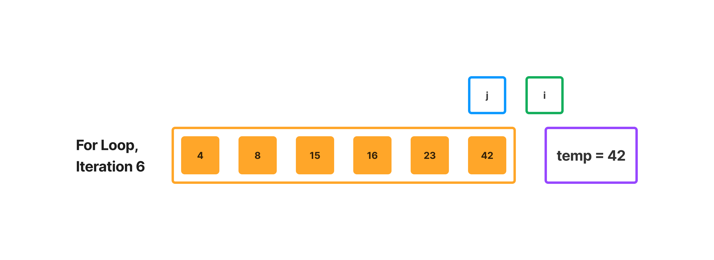

# Selection Sort

Step-by-step diagrams of an insertion sorting algorithm.

## Pseudocode

```
  InsertionSort(int[] arr)

    FOR i = 1 to arr.length

      int j <-- i - 1
      int temp <-- arr[i]

      WHILE j >= 0 AND temp < arr[j]
        arr[j + 1] <-- arr[j]
        j <-- j - 1

      arr[j + 1] <-- temp
```

## Example Array

`[8, 4, 23, 42, 16, 15]`

## Step-Through

Begin the for loop:


Temp is less than arr[j] (4 is less than 8), so start the while loop:


j is less than 0, so return to the for loop:


Temp is less than arr[j] (16 is less than 42), so start the while loop:


Temp is greater than arr[j] (16 is greater than 8), so return to the for loop:


Temp is less than arr[j] (15 is less than 42), so start the while loop:


Temp is greater than arr[j] (15 is greater than 8), so return to the for loop:



i is greater than arr.length; return sorted array.
