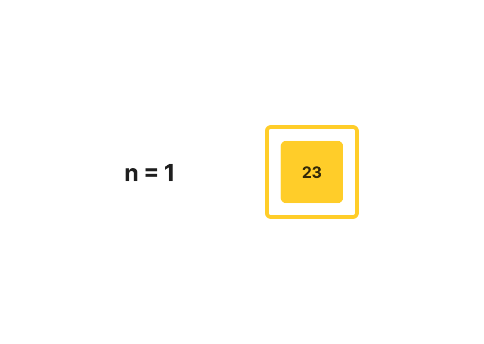
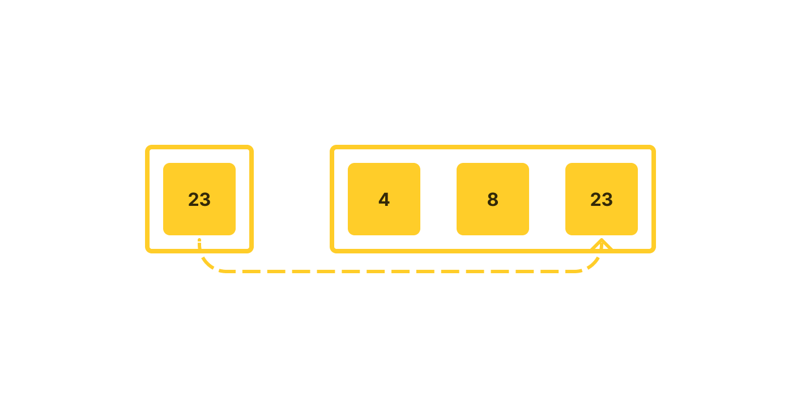
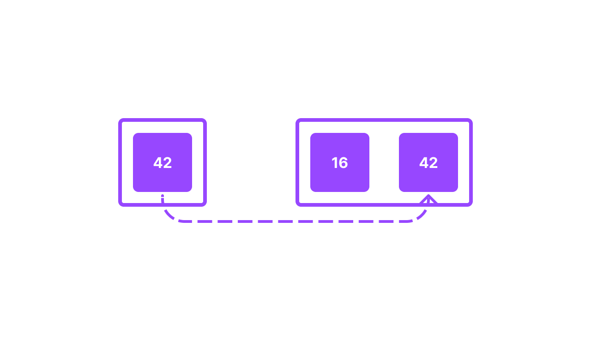

# Merge Sort

Step-by-step diagrams of a merge sorting algorithm. [See the code](../MergeSort.javaava) | [See the tests](../../../../../test/java/datastructures/sorting/sortingTest.java).

## Pseudocode

```
ALGORITHM Mergesort(arr)
    DECLARE n <-- arr.length

    if n > 1
      DECLARE mid <-- n/2
      DECLARE left <-- arr[0...mid]
      DECLARE right <-- arr[mid...n]
      // sort the left side
      Mergesort(left)
      // sort the right side
      Mergesort(right)
      // merge the sorted left and right sides together
      Merge(left, right, arr)

ALGORITHM Merge(left, right, arr)
    DECLARE i <-- 0
    DECLARE j <-- 0
    DECLARE k <-- 0

    while i < left.length && j < right.length
        if left[i] <= right[j]
            arr[k] <-- left[i]
            i <-- i + 1
        else
            arr[k] <-- right[j]
            j <-- j + 1

        k <-- k + 1

    if i = left.length
       set remaining entries in arr to remaining values in right
    else
       set remaining entries in arr to remaining values in left

```

## Example Array

`[8, 4, 23, 42, 16, 15]`

## Step-Through

Call mergeSort on the array:


n is greater than 1, so:


Call mergeSort on left:


n is greater than 1, so:


Call mergeSort on left:


n is greater than 1, so:


Call mergeSort on left:


n is 1, so call mergeSort on right:


n is also 1, so call merge on left, right, array:


left[i] is greater than right[j] (8 is greater than 4), so array[k] becomes right[j]; increment j and k:


j is not less than right.length and i does not equal left.length, so set remaining entries in array to entries in left:


Return to the previous function in the call stack with sorted left:


Call mergeSort on right:



n is one, so call merge on left, right, array:


left[i] is not greater than right[j] (4 is not greater than 23), so array[k] becomes left[i]; increment i and k:


left[i] is not greater than right[j] (8 is not greater than 23), so array[k] becomes left[i]; increment i and k:


i is not less than left.length; i equals left.length, so fill all remaining spots in array with all remaining values in right:



Return to the previous function in the call stack with sorted left:


Call mergeSort on right:


n is greater than one, so:


Call mergeSort on left:


n is greater than one, so:


Call mergeSort on left:


n is one, so call mergeSort on right:


n is also one, so call merge on right, left, array:


left[i] is greater than right[j] (42 is greater than 16), so array[k] becomes right[j]; increment j and k:


j is not less than right.length and i does not equal left.length, so set remaining entries in array to entries in left:



Return to the previous function in  the call stack with sorted left:


Call mergesort on right:


n is one, so call merge on left, right, array:


left[i] is greater than right[j] (16 is greater than 15), so array[k] becomes right[j]; increment j and k:


j is not less than right.length; i is less than left.length, so fill all remaining spots in arr with all remaining values in left:


Return to the previous function in the call stack with sorted right:


Call merge on left, right, array:


left[i] is not greater than right[j] (4 is not greater than 15), so array[k] becomes left[i]; increment i and k:


left[i] is not greater than right[j] (8 is not greater than 15), so array[k] becomes left[i]; increment i and k:


left[i] is greater than right[j] (23 is greater than 15), so array[k] becomes right[j]; increment j and k:


left[i] is greater than right[j] (23 is greater than 16), so array[k] becomes right[j]; increment j and k:


left[i] is not greater than right[j] (23 is not greater than 42), so array[k] becomes left[i]; increment i and k:


i is not less than left.length; i equals left.length, so fill all remaining spots in arr with all remaining values in right:


Return sorted array.

