# Quick Sort

Step-by-step diagrams of a quick sorting algorithm. [See the code](QuickSort.java) | [See the tests](../../../../../test/java/datastructures/sorting/sortingTest.java).

## Pseudocode

```.ignorelang
ALGORITHM QuickSort(arr, left, right)
if left < right
// Partition the array by setting the position of the pivot value
DEFINE position <-- Partition(arr, left, right)
// Sort the left
QuickSort(arr, left, position - 1)
// Sort the right
QuickSort(arr, position + 1, right)

ALGORITHM Partition(arr, left, right)
// set a pivot value as a point of reference
DEFINE pivot <-- arr[right]
// create a variable to track the largest index of numbers lower than the defined pivot
DEFINE low <-- left - 1
for i <- left to right do
if arr[i] <= pivot
low++
Swap(arr, i, low)

     // place the value of the pivot location in the middle.
     // all numbers smaller than the pivot are on the left, larger on the right.
     Swap(arr, right, low + 1)
    // return the pivot index point
     return low + 1

ALGORITHM Swap(arr, i, low)
DEFINE temp;
temp <-- arr[i]
arr[i] <-- arr[low]
arr[low] <-- temp
```

Call quickSort on array, left, right (left is 0; right is array length - 1):

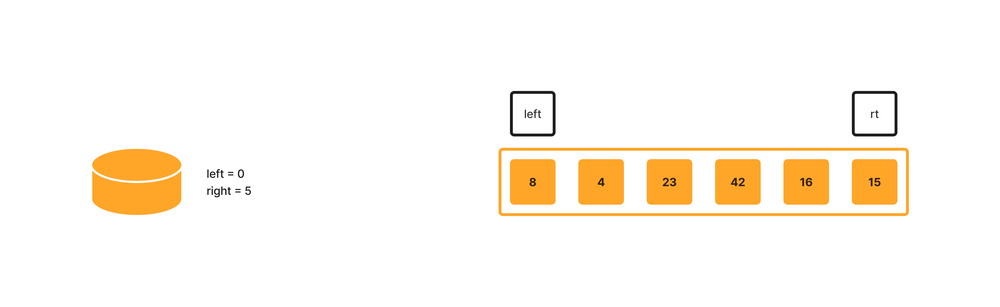

left is less than right, so call partition on array, left, right:

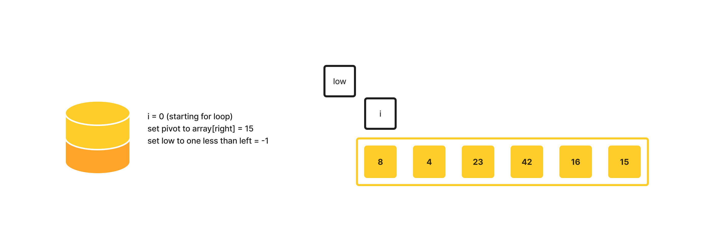

array[i] is less than pivot, so increment low and call swap, passing in array, i , low:

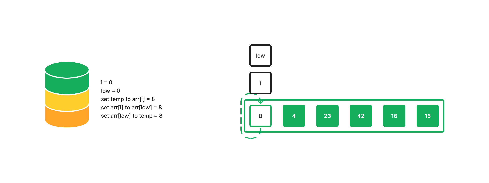

Return to the next function in the call stack with the modified array:

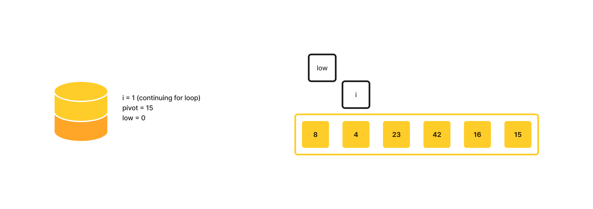

array[i] is less than pivot, so increment low and call swap, passing in array, i , low:

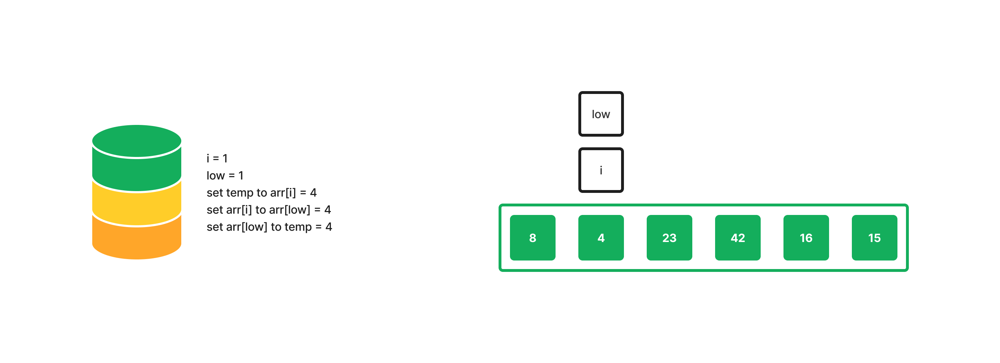

Return to the previous function in the call stack with the modified array:

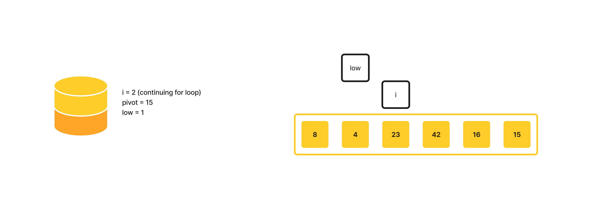

array[i] is not less than or equal to pivot, so continue for loop:

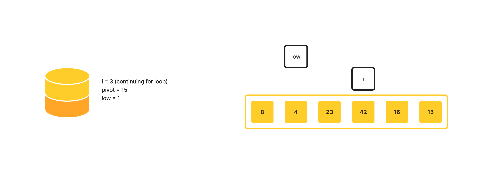

array[i] is not less than or equal to pivot, so continue for loop:

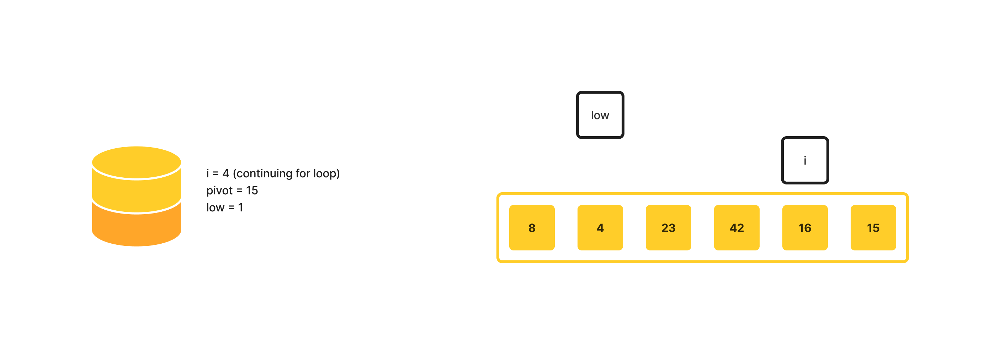

array[i] is not less than or equal to pivot and for loop is complete, so call swap on array, right, low + 1:

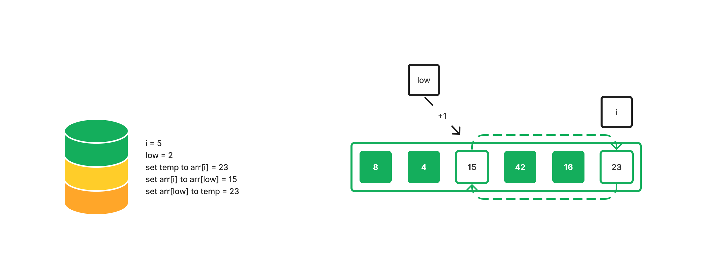

Return low + 1 (2); call quickSort, passing in array, left, position - 1 as right (position = low; 2-1 = 1):

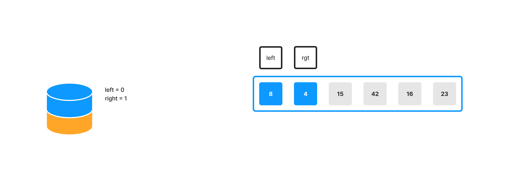

left is less than right, so call partition on array, left, right:

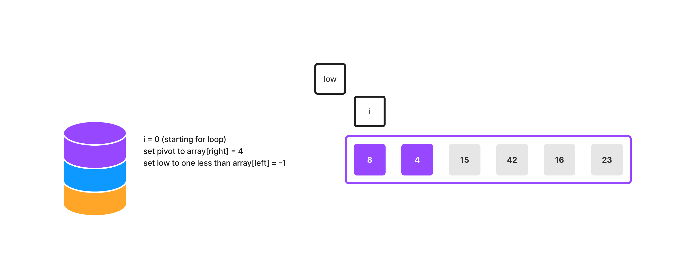

array[i] is not less than pivot, so continue for loop:

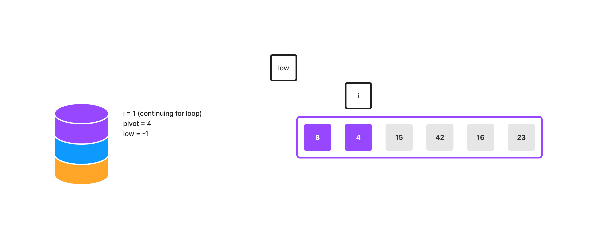

array[i] is not less than pivot; for loop is complete, so call swap on array, right, low + 1:

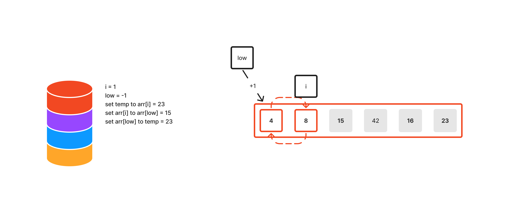

Return down the call stack; call quickSort, passing in array, position + 1 as left, right (position = low; position + 1 = 0)

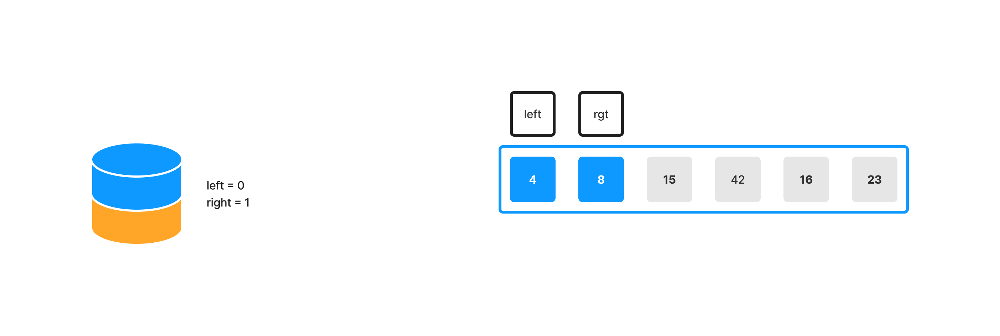

Move down the call stack and call quickSort, passing in the sorted array, position + 1, right:

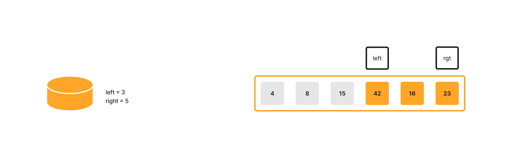

left is less than right, so call partition on array, left, right:

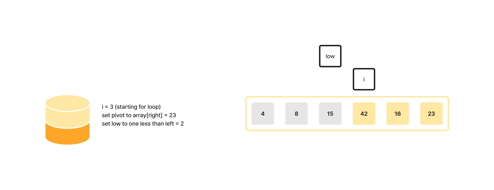

array[i] is not less than pivot, so continue for loop:

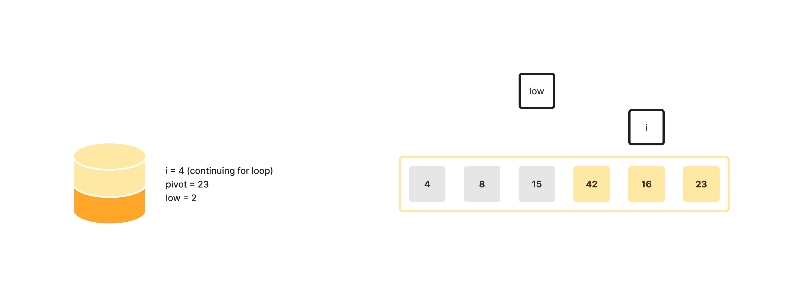

array[i] is less than pivot, so call increment low and call swap on array, i, low:

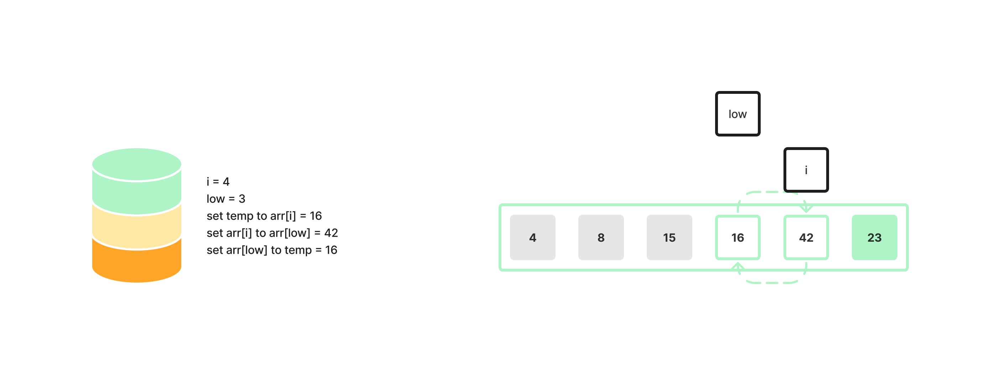

Return to the next function in the call stack with the modified array:

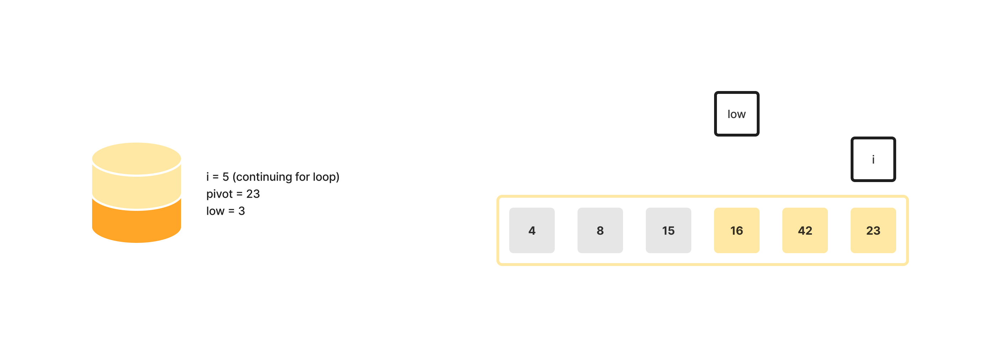

array[i] is not less than pivot; for loop is complete, so call swap on array, right, low + 1


Return sorted array
